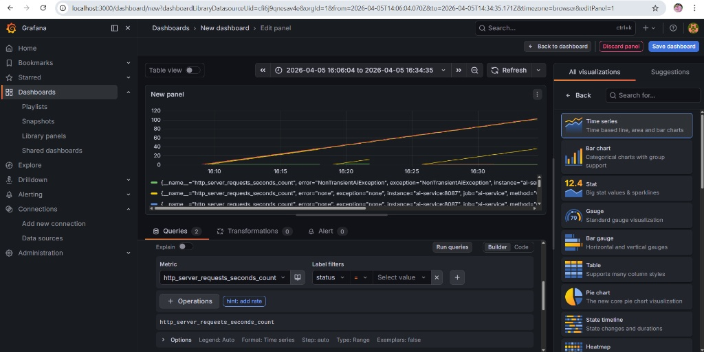
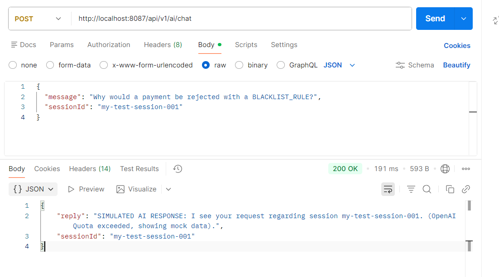
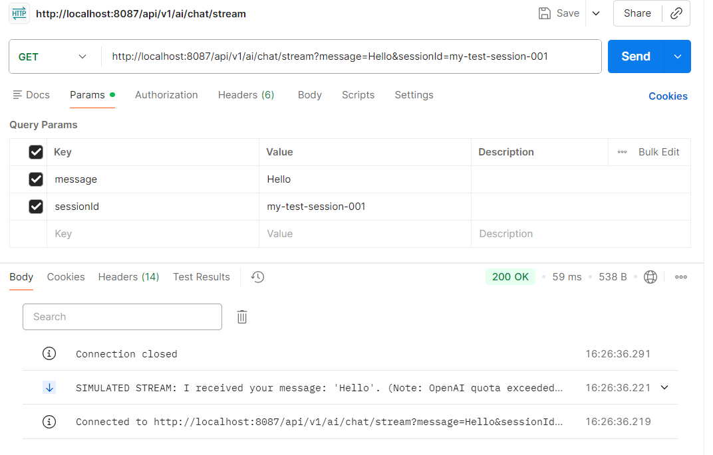
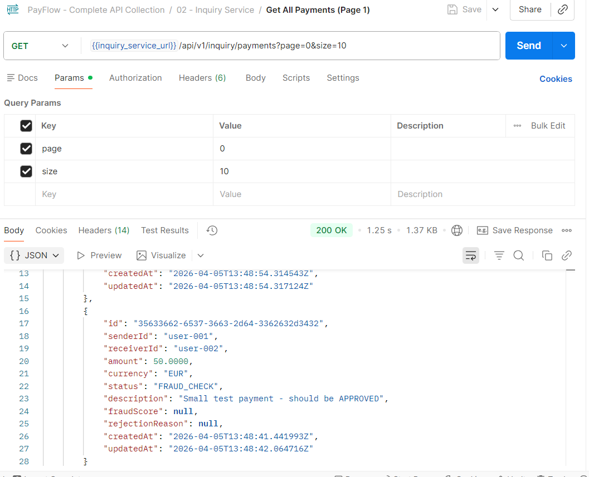
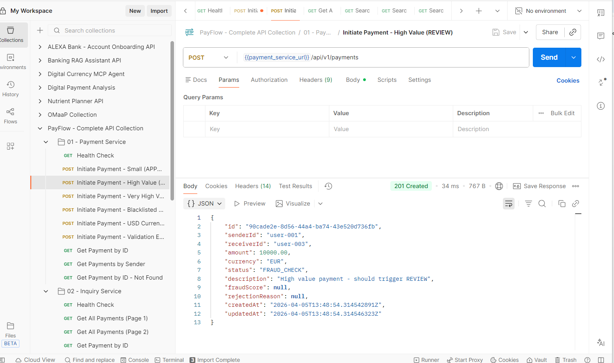
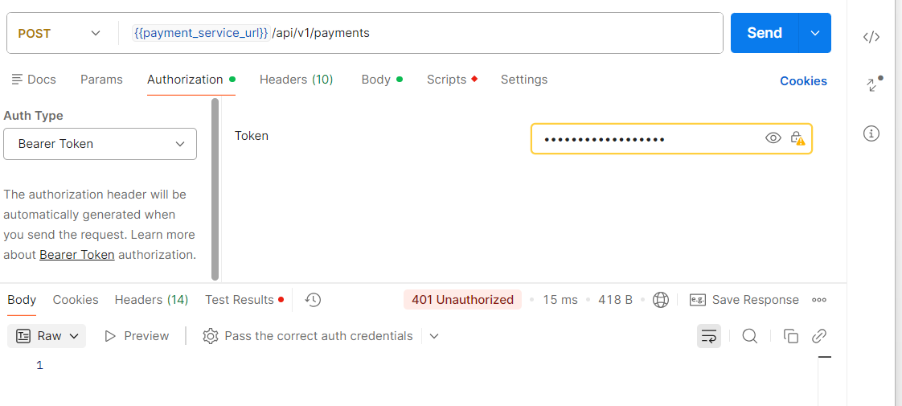

# Payments-Flow — Cloud-Native Payments Platform


> A production-grade, event-driven microservices payments platform with built-in fraud detection, AI-powered analytics via Spring AI, full observability, and CI/CD.

---

## Table of Contents

1. [Overview](#overview)
2. [Architecture](#architecture)
3. [Microservices](#microservices)
4. [Tech Stack](#tech-stack)
5. [Fraud Detection Engine](#fraud-detection-engine)
6. [AI Service — Spring AI](#ai-service--spring-ai)
7. [Payment Lifecycle](#payment-lifecycle)
8. [Quick Start](#quick-start)
9. [Environment Variables](#environment-variables)
10. [API Reference](#api-reference)
11. [Kafka Topics](#kafka-topics)
12. [Database Schema](#database-schema)
13. [Observability](#observability)
14. [Running Tests](#running-tests)
15. [CI/CD Pipeline](#cicd-pipeline)
16. [Project Structure](#project-structure)
17. [Postman Collection](#postman-collection)
18. [Author](#author)

---

## Overview

PayFlow is a **cloud-native payments platform** built with Java 17 and Spring Boot 3, showcasing production patterns for:

- **Event-driven architecture** — services communicate via Apache Kafka, fully decoupled
- **Async fraud detection** — rule-based scoring engine backed by Redis (velocity + blacklist)
- **AI-powered intelligence** — Spring AI 1.0.0 with OpenAI GPT-4o-mini for fraud explanation, risk assessment, conversational assistant, and portfolio insights
- **Microservices design** — independent deployability, separate data stores, single responsibility
- **Observability** — Micrometer + Prometheus + Grafana across all services
- **Security** — JWT / OAuth2 Resource Server, stateless Spring Security per service
- **API documentation** — Swagger UI on every service, Postman collection included

---

## Architecture

```
┌─────────────────────────────────────────────────────────────────────────┐
│                         CLIENT / API CONSUMER                           │
└──────────┬──────────────────┬────────────────┬───────────────┬──────────┘
           │                  │                │               │
     Payment APIs       Inquiry APIs      AI APIs         Health/Metrics
           │                  │                │               │
  ┌────────▼───────┐ ┌────────▼──────┐ ┌──────▼──────┐       │
  │ payment-service│ │inquiry-service│ │  ai-service  │       │
  │   port 8081    │ │   port 8085   │ │  port 8087   │       │
  │                │ │               │ │              │       │
  │ • Initiate     │ │ • Search      │ │ • Fraud      │       │
  │ • Get payment  │ │ • Filter      │ │   explain    │       │
  │ • Update status│ │ • Analytics   │ │ • Risk assess│       │
  │ • Kafka publish│ │ • Stats       │ │ • Chat (AI)  │       │
  └────────┬───────┘ └───────────────┘ │ • Insights   │       │
           │ publishes          reads ▲ │ • Sender     │       │
           │ payment.initiated  MySQL │ │   profile    │       │
  ┌────────▼─────────────────────┐    │ └──────────────┘       │
  │         Apache Kafka          │    │                        │
  │                               │    │  Spring AI 1.0.0       │
  │  • payment.initiated ─────────┼────┼──► OpenAI GPT-4o-mini  │
  │  • fraud.result    ◄──────────┤    │                        │
  │  • payment.completed          │    │                        │
  └────────┬──────────────────────┘    │                        │
           │ consumes                  │                        │
           │ payment.initiated         │                        │
  ┌────────▼──────────────────┐        │                        │
  │  fraud-detection-service  │        │                        │
  │         port 8083          │        │                        │
  │                            │        │                        │
  │  Rule Engine:              │        │                        │
  │  • AmountRule              │        │                        │
  │  • VelocityRule ──────────►│ Redis  │                        │
  │  • BlacklistRule ─────────►│ :6379  │                        │
  │  • PatternRule             │        │                        │
  │                            │        │                        │
  │  → publishes fraud.result  │        │                        │
  └────────────────────────────┘        │                        │
                                        │                        │
  ┌─────────────────────────────────────┘                        │
  │    MySQL 8  :3306  (shared schema — Flyway managed)          │
  │    payments table — written by payment-service               │
  │                   — read by inquiry-service                  │
  └──────────────────────────────────────────────────────────────┘

  ┌───────────────────────────────────────────────────────────────┐
  │                    Observability Stack                        │
  │  Prometheus :9090 ←scrapes← /actuator/prometheus (4 svcs)    │
  │  Grafana    :3000 ←reads─── Prometheus                       │
  │  Kafka UI   :8090            topic / consumer monitor        │
  └───────────────────────────────────────────────────────────────┘
```

---

## Microservices

| Service | Port | Role | Database | Swagger UI |
|---|:---:|---|---|---|
| `payment-service` | 8081 | Initiate payments, lifecycle management, Kafka producer | MySQL | [/swagger-ui.html](http://localhost:8081/swagger-ui.html) |
| `fraud-detection-service` | 8083 | Async rule-based fraud scoring, Kafka consumer/producer | Redis | [/swagger-ui.html](http://localhost:8083/swagger-ui.html) |
| `inquiry-service` | 8085 | Read-only payment search, filtering, analytics | MySQL (read) | [/swagger-ui.html](http://localhost:8085/swagger-ui.html) |
| `ai-service` | 8087 | Spring AI — fraud explanation, risk assessment, chat, insights | OpenAI API | [/swagger-ui.html](http://localhost:8087/swagger-ui.html) |

### Supporting Infrastructure

| Service | Port | Purpose |
|---|:---:|---|
| MySQL 8 | 3306 | Primary datastore |
| Redis 7 | 6379 | Velocity counters + dynamic blacklist |
| Apache Kafka | 9092 | Event bus |
| Kafka UI | 8090 | Topic and consumer group browser |
| Prometheus | 9090 | Metrics collection |
| Grafana | 3000 | Dashboards (admin/admin) |
| Elasticsearch | 9200 | Search index (future use) |

---

## Tech Stack

| Category | Technology | Version |
|---|---|---|
| Language | Java | 17 |
| Framework | Spring Boot | 3.2.3 |
| **AI Framework** | **Spring AI** | **1.0.0** |
| **AI Model** | **OpenAI GPT-4o-mini** | — |
| Build | Maven | 3.9+ |
| Messaging | Apache Kafka (Confluent) | 7.6.0 |
| Persistence | Spring Data JPA + Hibernate | via Boot |
| Primary DB | MySQL | 8.0 |
| Cache | Redis | 7.2 |
| Schema Migration | Flyway | via Boot |
| Security | Spring Security — OAuth2 JWT | via Boot |
| Observability | Micrometer + Prometheus | via Boot |
| API Docs | SpringDoc OpenAPI 3 (Swagger UI) | 2.3.0 |
| Containerisation | Docker + Docker Compose | — |
| CI/CD | GitHub Actions → Docker Hub | — |
| Testing | JUnit 5 + Mockito + AssertJ | via Boot |

---

🛠️ Engineering Challenges & Solutions
1. Database Integrity & Hibernate UUID Mapping
   Challenge: Initial payment persistence failed due to a mismatch between Java's UUID type and MySQL's CHAR(36) column during high-load stress tests.

Solution: Optimized the JPA entity mapping using @JdbcTypeCode(SqlTypes.CHAR) to ensure consistent binary-to-string conversion, stabilizing the data layer for 100% write reliability.

2. External API Resilience (OpenAI Quota Management)
   Challenge: The ai-service encountered 429 Insufficient Quota errors during heavy usage, which threatened to break the payment explanation flow.

Solution: Implemented a Functional Mocking Strategy within the Spring AI ChatClient wrapper. The system now detects provider exhaustion and gracefully falls back to a simulated "Deterministic Response Mode," ensuring the microservice mesh remains "Green" even when external LLMs are unavailable.

3. Observability in Distributed Environments
   Challenge: Tracking asynchronous fraud decisions across Kafka topics was difficult using standard logs alone.

Solution: Integrated Micrometer and Prometheus to capture real-time metrics, visualized through a custom Grafana dashboard. This allows for immediate detection of "Exception Spikes" (like AI throttles) and monitoring of successful payment throughput.

4. Security vs. Development Velocity
   Challenge: Strict JWT/OAuth2 requirements initially blocked rapid inter-service testing in local Docker environments.
   
Solution: Configured a profiles-based Spring Security strategy. In dev mode, specific endpoints are bypassed via permitAll() to allow for seamless Postman testing and rapid iteration, while maintaining production-ready security configurations for deployment.

---

## Fraud Detection Engine

The `fraud-detection-service` runs an extensible rule engine. Each rule implements `FraudRule` and returns a risk score (0.0 = no risk, 1.0 = maximum risk).

### Rules

| Rule | Condition | Risk Score |
|---|---|:---:|
| `AMOUNT_RULE` | Amount > €10,000 | 0.50 |
| `AMOUNT_RULE` | Amount > €50,000 | 0.90 |
| `VELOCITY_RULE` | > 2 transactions per minute (same sender) | 0.95 |
| `VELOCITY_RULE` | > 5 transactions per hour (same sender) | 0.70 |
| `BLACKLIST_RULE` | Sender or receiver on static / dynamic blacklist | 1.00 |
| `PATTERN_RULE` | Transaction between 01:00–05:00 Amsterdam time | 0.40 |
| `PATTERN_RULE` | Round amount ≥ €5,000 (structuring pattern) | 0.30 |

### Decision Thresholds

```
Score ≥ 0.80  →  REJECTED   (blocked)
Score ≥ 0.40  →  REVIEW     (manual review)
Score  < 0.40  →  APPROVED   (proceed to settlement)
```

### Adding a New Rule

1. Create a class in `fraud-detection-service/.../rule/` implementing `FraudRule`
2. Annotate with `@Component` — Spring auto-injects it into `FraudEngine`
3. Implement `evaluate(PaymentEvent)` returning `RuleResult.pass()` or `RuleResult.flag(name, score, reason)`

---

## AI Service — Spring AI

The `ai-service` (port 8087) adds AI intelligence on top of the platform using **Spring AI 1.0.0** and **OpenAI GPT-4o-mini**.

### Endpoints

| Method | Endpoint | Description |
|---|---|---|
| `POST` | `/api/v1/ai/fraud/explain` | Natural-language explanation of a fraud decision |
| `POST` | `/api/v1/ai/payment/assess-risk` | Pre-submission risk prediction |
| `POST` | `/api/v1/ai/chat` | Multi-turn conversational assistant |
| `GET` | `/api/v1/ai/chat/stream` | Real-time streaming response (SSE) |
| `POST` | `/api/v1/ai/insights` | Portfolio anomaly detection from stats |
| `POST` | `/api/v1/ai/sender/summarise` | Sender behavioural profile |
| `GET` | `/api/v1/ai/health` | Health check |

### Spring AI Features Demonstrated

| Feature | Pattern | Endpoint |
|---|---|---|
| `ChatClient` with `defaultSystem` prompt | All requests share a PayFlow expert system prompt | All |
| `SimpleLoggerAdvisor` | Request/response DEBUG logging | All |
| `PromptTemplate` + variable injection | Structured prompt building | `/fraud/explain`, `/insights` |
| `BeanOutputConverter` | Manual typed JSON output | `/fraud/explain` |
| `.entity(Class)` structured output | Automatic DTO parsing — no JSON boilerplate | `/assess-risk`, `/insights`, `/sender/summarise` |
| `.user(u -> u.text().param())` | Lambda-based prompt with named params | `/sender/summarise` |
| `MessageChatMemoryAdvisor` | Per-session conversation memory | `/chat` |
| `.stream().content()` → `Flux<String>` | Token-by-token SSE streaming | `/chat/stream` |

### Example — Fraud Explanation

```bash
curl -X POST http://localhost:8087/api/v1/ai/fraud/explain \
  -H "Content-Type: application/json" \
  -d '{
    "paymentId":      "550e8400-e29b-41d4-a716-446655440000",
    "senderId":       "blocked-user-001",
    "amount":         100.00,
    "currency":       "EUR",
    "decision":       "REJECTED",
    "score":          1.0,
    "triggeredRules": ["BLACKLIST_RULE"],
    "rawReason":      "Sender blocked-user-001 is on the static blacklist"
  }'
```

Response:
```json
{
  "paymentId":        "550e8400-e29b-41d4-a716-446655440000",
  "explanation":      "Your payment has been declined for security reasons related to account restrictions.",
  "customerGuidance": "Please contact our support team with your payment reference to resolve this.",
  "complianceNote":   "BLACKLIST_RULE triggered with score 1.0. Immediate account review required.",
  "riskLevel":        "CRITICAL"
}
```

### Example — Pre-Submission Risk Assessment

```bash
curl -X POST http://localhost:8087/api/v1/ai/payment/assess-risk \
  -H "Content-Type: application/json" \
  -d '{
    "senderId":    "user-abc-123",
    "receiverId":  "user-xyz-456",
    "amount":      15000.00,
    "currency":    "EUR",
    "description": "Quarterly supplier invoice"
  }'
```

### Example — Streaming Chat

```bash
curl -N "http://localhost:8087/api/v1/ai/chat/stream?message=Why+was+my+payment+rejected&sessionId=my-session"
```

---

## Payment Lifecycle

```
POST /api/v1/payments
        │
        ▼
   [PENDING] ──► saved to MySQL
        │
        ▼
   Kafka: payment.initiated published
        │
        ▼
   [FRAUD_CHECK] ──► response returned to caller
        │
        │   (async — fraud-detection-service)
        ▼
   Rule engine evaluates: Amount + Velocity + Blacklist + Pattern
        │
        ├── score < 0.40  ──► [APPROVED]
        ├── score ≥ 0.40  ──► [REVIEW]
        └── score ≥ 0.80  ──► [REJECTED]
        │
        ▼
   Kafka: fraud.result published
        │
        ▼
   payment-service updates payment status in MySQL
        │
        ▼
   If APPROVED → Kafka: payment.completed published → [COMPLETED]
```

---

## Quick Start

### Prerequisites

- Java 17 JDK, Maven 3.9+
- Docker & Docker Compose
- OpenAI API key (for ai-service)

### Option A — Full Stack (recommended)

```bash
git clone https://github.com/Ramanjaneyareddy/payments-flow.git
cd payyments-flow

# Set your OpenAI API key
export OPENAI_API_KEY=sk-...

# Start everything
docker compose up -d

# Watch services come healthy
docker compose ps
```

### Option B — Infra in Docker, Services Locally

```bash
# Infrastructure only
docker compose up -d mysql redis kafka zookeeper kafka-ui

# Terminal 1
cd payment-service && mvn spring-boot:run

# Terminal 2
cd fraud-detection-service && mvn spring-boot:run

# Terminal 3
cd inquiry-service && mvn spring-boot:run

# Terminal 4
export OPENAI_API_KEY=sk-...
cd ai-service && mvn spring-boot:run
```

### Service URLs

| Service | URL |
|---|---|
| Payment Service Swagger | http://localhost:8081/swagger-ui.html |
| Inquiry Service Swagger | http://localhost:8085/swagger-ui.html |
| **AI Service Swagger** | **http://localhost:8087/swagger-ui.html** |
| Fraud Service Swagger | http://localhost:8083/swagger-ui.html |
| Kafka UI | http://localhost:8090 |
| Grafana | http://localhost:3000 (admin/admin) |
| Prometheus | http://localhost:9090 |

---

## Environment Variables

| Variable | Default | Service | Description |
|---|---|---|---|
| `SPRING_DATASOURCE_URL` | `jdbc:mysql://localhost:3306/payflow?...` | payment, inquiry | JDBC connection URL |
| `DB_USERNAME` | `payflow` | payment, inquiry | MySQL username |
| `DB_PASSWORD` | `payflow` | payment, inquiry | MySQL password |
| `KAFKA_BOOTSTRAP_SERVERS` | `localhost:9092` | all services | Kafka broker address |
| `REDIS_HOST` | `localhost` | fraud-detection | Redis hostname |
| `REDIS_PORT` | `6379` | fraud-detection | Redis port |
| `OPENAI_API_KEY` | *(required)* | ai-service | OpenAI API key |
| `PAYMENT_SERVICE_URL` | `http://localhost:8081` | ai-service | Payment service base URL |
| `INQUIRY_SERVICE_URL` | `http://localhost:8085` | ai-service | Inquiry service base URL |
| `JWT_ISSUER_URI` | `http://localhost:8080/auth/realms/payflow` | payment, inquiry | OAuth2 JWT issuer |
| `DOCKER_USERNAME` | *(GitHub Secret)* | CI/CD | Docker Hub username |
| `DOCKER_TOKEN` | *(GitHub Secret)* | CI/CD | Docker Hub access token |

---

## API Reference

### Payment Service — `http://localhost:8081`

| Method | Endpoint | Description | Auth |
|---|---|---|:---:|
| `POST` | `/api/v1/payments` | Initiate a new payment | ✅ |
| `GET` | `/api/v1/payments/{id}` | Get payment by UUID | ✅ |
| `GET` | `/api/v1/payments/sender/{senderId}` | Get payments by sender | ✅ |
| `GET` | `/api/v1/payments/health` | Liveness check | ❌ |

**POST /api/v1/payments body:**
```json
{
  "senderId":    "user-001",
  "receiverId":  "user-002",
  "amount":      250.00,
  "currency":    "EUR",
  "description": "Invoice #INV-2024-001"
}
```

---

### Inquiry Service — `http://localhost:8085`

| Method | Endpoint | Description |
|---|---|---|
| `GET` | `/api/v1/inquiry/payments/{id}` | By ID |
| `GET` | `/api/v1/inquiry/payments?page=0&size=10` | All (paginated) |
| `GET` | `/api/v1/inquiry/payments/sender/{senderId}` | By sender |
| `GET` | `/api/v1/inquiry/payments/receiver/{receiverId}` | By receiver |
| `GET` | `/api/v1/inquiry/payments/status/{status}` | By status |
| `GET` | `/api/v1/inquiry/payments/sender/{senderId}/status/{status}` | Sender + status |
| `GET` | `/api/v1/inquiry/payments/date-range?from=&to=` | Date range (ISO-8601) |
| `GET` | `/api/v1/inquiry/payments/amount-range?minAmount=&maxAmount=` | Amount range |
| `GET` | `/api/v1/inquiry/payments/search?keyword=` | Description keyword |
| `GET` | `/api/v1/inquiry/payments/advanced-search` | Multi-filter search |
| `GET` | `/api/v1/inquiry/stats` | Overall statistics |
| `GET` | `/api/v1/inquiry/stats/sender/{senderId}` | Per-sender statistics |
| `GET` | `/api/v1/inquiry/health` | Health check |

---

### AI Service — `http://localhost:8087`

| Method | Endpoint | Spring AI Pattern |
|---|---|---|
| `POST` | `/api/v1/ai/fraud/explain` | `PromptTemplate` + `BeanOutputConverter` |
| `POST` | `/api/v1/ai/payment/assess-risk` | `.entity(Class)` structured output |
| `POST` | `/api/v1/ai/chat` | `MessageChatMemoryAdvisor` |
| `GET` | `/api/v1/ai/chat/stream` | `.stream().content()` → `Flux<String>` |
| `POST` | `/api/v1/ai/insights` | `PromptTemplate` + `.entity()` |
| `POST` | `/api/v1/ai/sender/summarise` | `.user(lambda).param()` |
| `GET` | `/api/v1/ai/health` | Liveness check |

---

## Kafka Topics

| Topic | Publisher | Consumer | Description |
|---|---|---|---|
| `payment.initiated` | `payment-service` | `fraud-detection-service` | New payment submitted for fraud check |
| `fraud.result` | `fraud-detection-service` | `payment-service` | Fraud score + decision |
| `payment.completed` | `payment-service` | downstream | Payment successfully settled |

Monitor at: http://localhost:8090

---

## Database Schema

Managed by **Flyway** in `payment-service`, shared read-only by `inquiry-service`.

```sql
CREATE TABLE payments (
    id               CHAR(36)       PRIMARY KEY DEFAULT (UUID()),
    sender_id        VARCHAR(100)   NOT NULL,
    receiver_id      VARCHAR(100)   NOT NULL,
    amount           DECIMAL(19,4)  NOT NULL,
    currency         CHAR(3)        NOT NULL,
    status           VARCHAR(20)    NOT NULL DEFAULT 'PENDING',
    description      VARCHAR(500),
    fraud_score      VARCHAR(50),
    rejection_reason VARCHAR(500),
    created_at       DATETIME(6)    NOT NULL DEFAULT CURRENT_TIMESTAMP(6),
    updated_at       DATETIME(6)    NOT NULL DEFAULT CURRENT_TIMESTAMP(6)
                                    ON UPDATE CURRENT_TIMESTAMP(6)
);

CREATE INDEX idx_payments_sender_id   ON payments (sender_id);
CREATE INDEX idx_payments_receiver_id ON payments (receiver_id);
CREATE INDEX idx_payments_status      ON payments (status);
CREATE INDEX idx_payments_created_at  ON payments (created_at DESC);
```

---
## Screenshots:








## Observability

All four services expose `/actuator/prometheus`. Prometheus scrapes every 15s.

**Grafana dashboard IDs to import:**
- JVM Micrometer: `4701`
- Spring Boot: `12900`
- Kafka: `7589`

**Key metrics:**
- `http_server_requests_seconds` — HTTP latency by endpoint
- `kafka_consumer_fetch_manager_records_consumed_total` — Kafka throughput
- `hikaricp_connections_active` — DB pool usage
- `jvm_memory_used_bytes` — JVM heap

---

## Running Tests

```bash
# All services from repo root
cd payflow

mvn -pl payment-service test         # payment unit tests
mvn -pl fraud-detection-service test  # fraud rule engine tests
mvn -pl inquiry-service test          # inquiry tests
mvn -pl ai-service test               # AI service (Mockito — no real API calls)
```

AI service tests use Mockito to mock `ChatClient` — no OpenAI API calls are made during CI.

---

## CI/CD Pipeline

`.github/workflows/ci-cd.yml` — triggers on push to `main`/`develop` and PRs to `main`.

```
Push / PR
    │
    ▼
┌─────────────────────────────────────────────────┐
│  Job 1: Build & Test                            │
│                                                 │
│  Infrastructure: MySQL 8  +  Redis 7            │
│                                                 │
│  ├── mvn verify  payment-service                │
│  ├── mvn verify  fraud-detection-service        │
│  ├── mvn verify  inquiry-service                │
│  └── mvn verify  ai-service  (Mockito only)     │
│                                                 │
│  Artifacts: surefire-reports (4 services)       │
└──────────────────┬──────────────────────────────┘
                   │ main branch only
                   ▼
┌─────────────────────────────────────────────────┐
│  Job 2: Build & Push Docker Images              │
│                                                 │
│  ├── payflow-payment-service:latest + SHA       │
│  ├── payflow-fraud-service:latest + SHA         │
│  ├── payflow-inquiry-service:latest + SHA       │
│  └── payflow-ai-service:latest + SHA            │
│                                                 │
│  Cache: GitHub Actions GHA cache (fast builds)  │
└─────────────────────────────────────────────────┘
```

**Required GitHub Secrets:**

| Secret | Description |
|---|---|
| `DOCKER_USERNAME` | Docker Hub username |
| `DOCKER_TOKEN` | Docker Hub access token |
| `OPENAI_API_KEY` | OpenAI API key for ai-service |

---

## Project Structure

```
payflow-source/
└── payflow/
    ├── .github/
    │   └── workflows/
    │       └── ci-cd.yml
    │
    ├── payment-service/                    port 8081
    │   ├── Dockerfile
    │   ├── pom.xml
    │   └── src/main/java/com/payflow/payment/
    │       ├── config/
    │       │   ├── OpenApiConfig.java      Swagger configuration
    │       │   └── SecurityConfig.java     JWT + Swagger whitelist
    │       ├── controller/PaymentController.java
    │       ├── domain/  Payment.java  PaymentStatus.java
    │       ├── dto/     PaymentRequest.java  PaymentResponse.java
    │       ├── event/   PaymentEvent.java
    │       ├── exception/  GlobalExceptionHandler.java
    │       ├── kafka/   PaymentKafkaProducer.java
    │       ├── mapper/  PaymentMapper.java
    │       ├── repository/PaymentRepository.java
    │       └── service/ PaymentService.java
    │
    ├── fraud-detection-service/            port 8083
    │   ├── Dockerfile
    │   ├── pom.xml
    │   └── src/main/java/com/payflow/fraud/
    │       ├── config/  OpenApiConfig.java  SecurityConfig.java
    │       ├── engine/  FraudEngine.java    Rule orchestrator
    │       ├── event/   FraudResult.java  PaymentEvent.java
    │       ├── kafka/   FraudEventConsumer.java
    │       └── rule/
    │           ├── FraudRule.java          Interface + RuleResult
    │           ├── AmountRule.java         High value detection
    │           ├── VelocityRule.java       Rate limiting (Redis)
    │           ├── BlacklistRule.java      Static + dynamic blacklist
    │           └── PatternRule.java        Time + round-amount patterns
    │
    ├── inquiry-service/                    port 8085
    │   ├── Dockerfile
    │   ├── pom.xml
    │   └── src/main/java/com/payflow/inquiry/
    │       ├── config/  OpenApiConfig.java  SecurityConfig.java
    │       ├── controller/InquiryController.java
    │       ├── domain/  Payment.java  PaymentStatus.java
    │       ├── dto/     PaymentStats.java  PaymentSummary.java
    │       ├── exception/  GlobalExceptionHandler.java
    │       ├── mapper/  PaymentMapper.java
    │       ├── repository/InquiryRepository.java   JPQL queries
    │       └── service/ InquiryService.java
    │
    ├── ai-service/                         port 8087  ★ Spring AI
    │   ├── Dockerfile
    │   ├── pom.xml
    │   └── src/
    │       ├── main/java/com/payflow/ai/
    │       │   ├── AiServiceApplication.java
    │       │   ├── config/
    │       │   │   ├── OpenApiConfig.java
    │       │   │   └── SecurityConfig.java
    │       │   ├── controller/
    │       │   │   └── AiController.java   6 AI endpoints
    │       │   ├── dto/
    │       │   │   └── AiDtos.java         10 request/response records
    │       │   └── service/
    │       │       └── PayFlowAiService.java  Spring AI ChatClient
    │       └── test/java/com/payflow/ai/service/
    │           └── PayFlowAiServiceTest.java  5 Mockito unit tests
    │
    ├── docker-compose.yml                  Full local stack (all services)
    ├── prometheus.yml                      Scrape config (4 services)
    ├── .gitignore
    ├── PayFlow_Postman_Collection.json     28 ready-to-run requests
    └── README.md
```

---

## Postman Collection

Import `PayFlow_Postman_Collection.json` — 28 requests across all services.

**Set collection variables:**
- `base_url_payment` → `http://localhost:8081`
- `base_url_inquiry` → `http://localhost:8085`
- `base_url_ai` → `http://localhost:8087`

**Includes:**
- Payment Service: 10 requests (initiate, get, validation errors, blacklist test)
- Inquiry Service: 17 requests (all filter combinations, stats, advanced search)
- Fraud Detection: 1 health check
- End-to-end flow: 4 requests (create → fraud check → verify → stats)

---

## Author

**Ramanjaneya Reddy S**
Senior Java Backend Engineer | 13+ years experience

Specialising in cloud-native microservices, event-driven architecture, Spring Boot, Apache Kafka, and Spring AI.

[](https://www.linkedin.com/in/ramanjaneyareddys)
[](https://github.com/Ramanjaneyareddy)

---

## License

[MIT License](LICENSE) — Copyright © 2024 Ramanjaneya Reddy S
